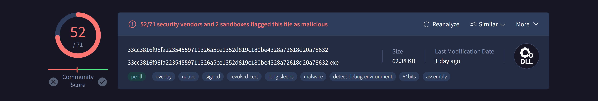
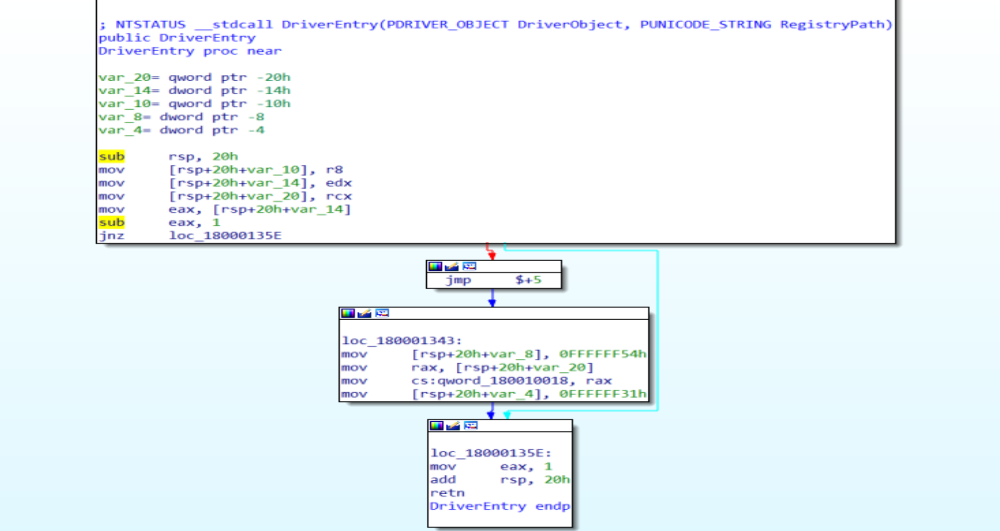
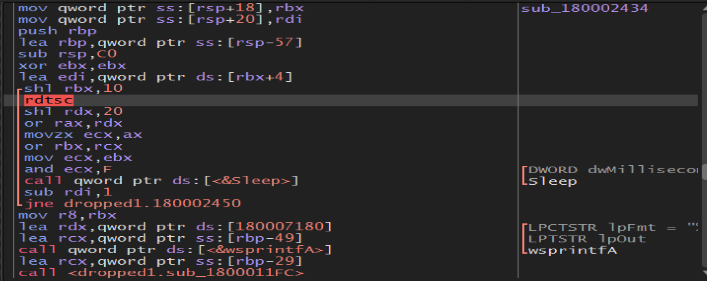

# icedID Analysis

File Hash is:
> DF75313A6C6AF17BCFBAA55A693314B34CF97C1E

Uploading our sample to virus total:

52/71 security vendors and 2 sandboxes flagged this file as malicious

SandBox Results
---

File type:
- Win32 DLL

Exports:

- DfcidmAgqxxIybvoovbd
- DllGetClassObject
- DllRegisterServer
- FbyouxodmaAmblxtzonyr 
- GhjrgreaggXyoydphfea 
- NrmqrpckejMlzraxTtfncwsvfmhs
- PluginInit

## Static Analysis

By Uploading sample to Die:

we will notice the sample is not Packed.

File is compiled at 2021/07/06  Tue 07:53:01 UTC

By Uploading sample to PE-bear:

we will find 1 library called `KERNEL32.dll` and 6 imports calling from the function like:

- GetThreadPriority
- GetCurrentThread
- CreateThread
- WaitForSingleObject
- DuplicateHandle
- ResumeThread

Using Pestudio:

### Host-Based Indicators

- Registry > DllRegisterServer

### Network-Based Indicators

- Url > http://ocsp.comodoca.com0
- Url > http://ocsp.sectigo.com0
- Url > https://sectigo.com/CPS0

## Advanced Static and Dynamic Analysis

### We will upload the sample into IDA Pro and  X64 Debugger

if we look at the main function we will not notice any thing suspicious

so, we should look at exports but some of exports doesn't make any thing too except `DllRegisterServer` it calling a lot of API'S

- we will notice a function called `VirtualAlloc` that is be ready to fill with some thing suspicious.
so, we will go to the return function wating to fill it 

- we will put this binary into file and start to make an analysis on it.
so, I think this malware works as a dropper

## Dropped1.exe Analysis

File SHA-256 Hash is:
> 9FF5C9CE0D1536CE8B043B10758453E3349A82CC31195CA57250A272E65B4DA4

#### Uploading our sample to virus total:

52/69 security vendors and 1 sandbox flagged this file as malicious

Using `CFF Explorer` we will find 6 libraries and alot of imports called from those functions.

Using `Die` we will notice that the Entropy is very high but the file is not packed, that may indicate to the Encryption methods is a lot.

Thread starting Address at `00000001800015B4` we will follow this address in X64 debugger

- we will see functions as `sleep` and `rdtsc` malware author maybe using them to bypass Sandboxes and detect debuggers we can pass them because they waste our time.

it will compare register r8 20 times to decrypt or encrypt some thing.

so, by get in the loop and follow the memory address in Dump we will find string that may be the attacker host `revedanstvy.bid `

- Malware author put a legitimate website may be to get us lost and distracted

- Malware try to Makes us confused and disappered by send the information to C2C server under `gads` >> `Google ads` or any words related with google to bypass firewalls or others related with network.

- Malware calls  calls `RtAllocateHeap` to empty a place in the memory heap and fill it with the process information by calling function called `wsprintfW` to print those information in this empty place.

- Malwre get information about `GetTickCount64` and add it to the cookies by call `wsprintfW`.

- malware calling a library called `NTDLL.dll` to get a process Address from it called `ZwQuerySystemInformation` to get a system information.

- Malware called a fuction called `RtlGetVersion` to know the windows version and build generation

- Now he get information about CPU type and another information and put them in the Allocated memory.

- From Kernel32 malware imports function called `GetComputerNameExA` and `GetUserNameA` to get some information about the computer and the user.

- Malware Loads library from `Kernel32.DLL` called `GetNativeSystemInfo` to get some information about the system.

- Malware called Library `IPHLPAPI.DLL` and imports from it function called `GetAdaptersInfo` to retrieves adapter information for the local computer.
The GetAdaptersInfo function can retrieve information only for IPv4 addresses. 

- Malware called functions like `CreateFileA`, `WriteFileA` to make a file and write all the extracted data in it then send it to the C2C Server(Attacker Server) by using functions like `WinHttpSendRequest`, `WinHttpQueryOption`, `WinHttpSetOption`, `WinHttpQueryDataAvailable`, `WinHttpReadData`, `WinHttpReceiveResponse`, `WinHttpQueryHeaders`, `WinHttpConnect`, `WinHttpCloseHandle`, `WinHttpOpen`, `WinHttpOpenRequest`, `WinHttpSetStatusCallback` Imported from `WINHTTP.dll` and the file may be disappear as a "Google ads" or under a legitimated site like "Amazon.com" to bypass firewalls or any protection technique across the Network.

## Dropped2.exe Analysis

File SHA-256 Hash is:
> 41A6F3C590EA10C7E3D3D9B31DBCB0F0477AA39E2E4948B2B5619961A7708295

#### Uploading our Sample to Die:

we will notice that the Entropy is very low that indicates to that the file is not packed.

File Compiled at 2021/06/09 Wed 14: 10: 13 UTC

- file is not have any Imports or Exports it has three functions doing some Calculation 

- No security vendors or sandboxes have flagged this file as malicious.

----